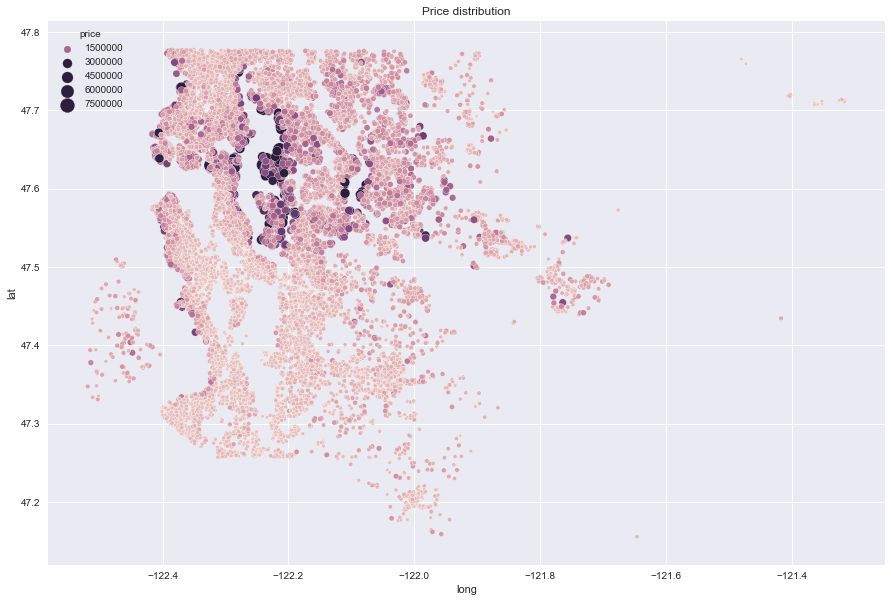
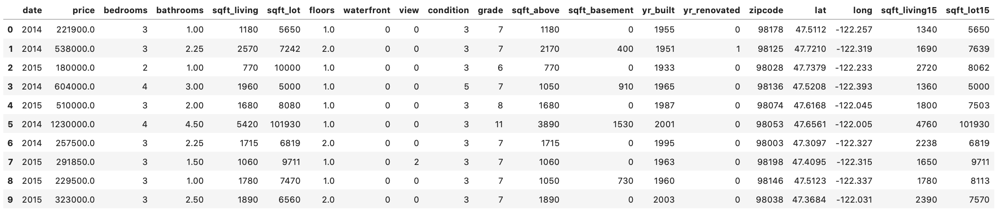
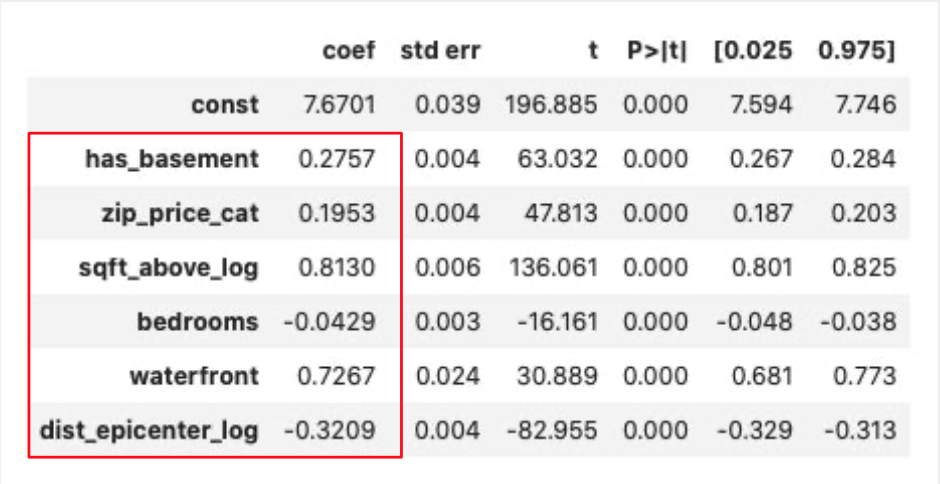

# Kings County House Sales - Linear Regression


## Overview

The project analyzes the house prices in the King County, Washington for a real estate agency. Based on the analysis results, the house prices depend on many factors but there are a few the most significat that have the biggest impact on th eprice, i.e house square footage, location from Seattle and Bellevue as well as the zipcode where the given house is located. Also the waterfront properties can cost as much as over 100% more then the other properties. The RE agency could easily estimate the house price by providing some basic information about the property like the address and square footage, number of bedrooms, etc.

## Business Problem

The real estate agency is planning to implement a price estimation system to better estimate the house prices for their future clients. The system will also help the agency itself to find better deals, search for new clients and expand the scope of services they can offer. 




## Data

The King County House Sales dataset contains over 20.000 records of house sales information in the King County in Washington. The records include the data like square footage, number of bedrooms and bathrooms, location, condition of property, price, date of sale, etc. 



## Methods

This project uses the linear regression algorythm to predtict a property price based on the input basic information about the property. 


## Results

Key factors that has the most significant impact on the house price:
- Square footage - a 10% increase in the house square footage leads to a 8% increase in price
- Waterfront properties - the price of the house increases by 107% if waterfront equals 1
- Distance from Seattle/Bellevue - a 10% increase in distance from the epicenter leads to a 3% decrease in price
- Basement - the price of the house increases by 32% if the house has a basement (equals 1)
- Zip code - the price of the house increases by 22% when increasing the zip code category by 1




## Conclusions

This analysis leads to three conclusions regarding the price and the most significant factors that have an impact on the price:

- **Waterfront properties can increase the price over 100%** Properties that face the waterfront are significantly more expensive than other similiar properties. 
- **Price of property is affected by the mean property price in a given zipcode.** The neighbourhood and price levels in each zipcode has an impact on the price. 
- **Location, location, location** The closer the property is located to Seatlle and Bellevue the more expensive it gets. Every 10% increase in the distance from the epicenter leads to a 3% decrease in price

### Next Steps

Using the prediction model can help to eastimate the property price and and find properties with a price increase potential when searching for a house. The model also helps to estimate the best list and sale price range:

- **Good tool to find an investment property** If you're looking for a property below the market price, this tool can help to find, check and compare the house price with the estimated market price.
- **Find out what's the best list and sale price** It's always the biggest question mark what price I should list and sell my house for. Use the model to find the right one and know the wiggle room. 


## For More Information

See the full analysis in the [Jupyter Notebook](./LR Model - Test 9.ipynb) or review this [presentation](./KING COUNTY HOUSE SALES - LINEAR REGRESSION MODEL.pdf).

## Repository Structure

```
├── viz
├── README.md
├── kc_house_data.csv
├── df_processed.pickle
├── LR Model - Test 9.ipynb
└── KING COUNTY HOUSE SALES - LINEAR REGRESSION MODEL.pdf
```
